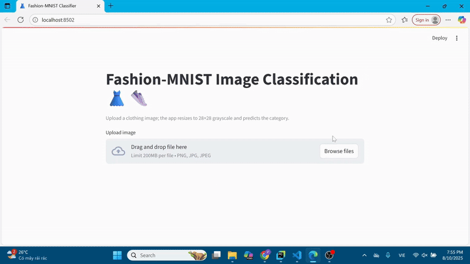

# 👗👜 Fashion-MNIST Image Classification Web App

This project is a web application that uses an **Artificial Neural Network (ANN)** to classify clothing images from the **Fashion-MNIST** dataset of Tensorflow. The user interface is built with **Streamlit**, allowing users to upload an image and instantly receive prediction results. The dataset contains 60,000 grayscale 28×28 images across 10 clothing categories. The ANN model was trained for 10 epochs with a batch size of 256, achieving high accuracy on the test set. The app automatically resizes and converts any uploaded image to the 28×28 grayscale format used during training.

---

## Project Structure

```
Fashion_Image_Classification/
│
├── app/
│   ├── app.py                     # Streamlit web app code
│   ├── fashion_mnist_model.keras  # Pre-trained ANN model
│
├── sample_images/                 # Example images for testing
│   ├── t_shirt1.jpg
│   ├── trouser1.jpg
│   └── ...
│
├── ann.ipynb                       # Jupyter Notebook for ANN training
├── requirements.txt                # Python dependencies
└── README.md                       # Project documentation
```

---

## Installation

1. **Clone the repository**
```bash
git clone https://github.com/nguyenkyphuong/Fashion_Image_Classification.git
cd Fashion_Image_Classification
```

2. **Create a virtual environment and install dependencies**
```bash
python -m venv venv
# Activate the environment
source venv/bin/activate   # Mac/Linux
venv\Scripts\activate      # Windows
# Install dependencies
pip install -r requirements.txt
```

---

## Running the Application

To launch the Streamlit app:
```bash
streamlit run app/app.py
```
Once started, the application will be available at:
[http://localhost:8501](http://localhost:8501)

---

## Usage Instructions

1. Open the application in your web browser.
2. Click **Browse files** and select a `.png`, `.jpg`, or `.jpeg` file.
3. The application will display:
   - The uploaded image.
   - The predicted clothing category.
   - The top-3 predicted classes with probabilities.

---

## Model Details

- **Architecture**: Fully-connected Artificial Neural Network (ANN).
- **Training Data**: [Fashion-MNIST-from-Tensorflow](https://www.tensorflow.org/datasets/catalog/fashion_mnist?hl=vi)
- **Input**: 28×28 grayscale image.
- **Output Classes**:
1. T-shirt/top  
2. Trouser  
3. Pullover  
4. Dress  
5. Coat  
6. Sandal  
7. Shirt  
8. Sneaker  
9. Bag  
10. Ankle boot  

---

## Sample Images

The `sample_images/` directory contains example images for all 10 classes. This allows recruiters or testers to quickly evaluate the app without sourcing their own images.  
To test:
1. Launch the web app.
2. Select an image from the `sample_images/` directory.
3. View prediction results instantly.

---

## Demo
